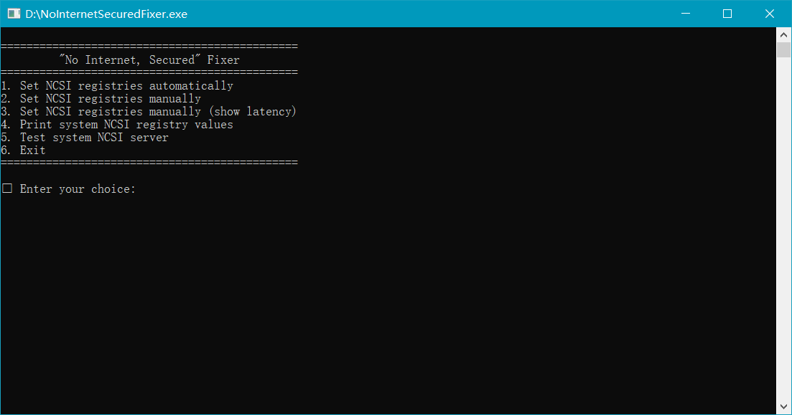

# No Internet Secured Fixer

Windows often shows `No Internet, secured` when the network connection is working fine. Some applications rely on the network status reported by Windows to determine if the network connection is available, such as Spotify, which won't let me play any songs when Windows reports "No Internet, secured". And if Windows thinks there is no internet connection, I can't turn on the hotspot. This is very annoying.

The main cause of this problem is Windows' Network Connectivity Status Indicator (NCSI). By default, NCSI sends HTTP requests and DNS requests to Microsoft's servers and checks if the returned results match the results saved in the registry, and if they do, the network is considered normal. 

However, this process may not always work due to server instability or other complex reasons, and when NCSI cannot get the correct response, it assumes that there is no network connection and causes Windows to display "No Internet, secured". So this program provides some alternative servers to replace the Microsoft servers used by NCSI by default, and you can see all the servers used by this program in the [servers.json](servers.json) file.

So this program will not help you to solve the network connection error, this program is used to solve the problem that your network connection is fine, but Windows reports "No Internet, secured".

Because modifying NCSI settings requires modifying the system registry, this program requires administrator privileges.

#  Screenshot

# Usage

- Download the program from the release page, open it and grant administrator privileges.
- Follow the menu prompts to select the action you need. Usually, you only need to select the first item (Set NCSI registries automatically) and the program will automatically test all servers in the [servers.json](servers.json) file and automatically select the server with the least latency as your NCSI server.
- Disable and re-enable your internet connection or restart your computer and the "No Internet, secured" will disappear.

# References

- [https://github.com/crazy-max/WindowsSpyBlocker](https://github.com/crazy-max/WindowsSpyBlocker)

# License

MIT